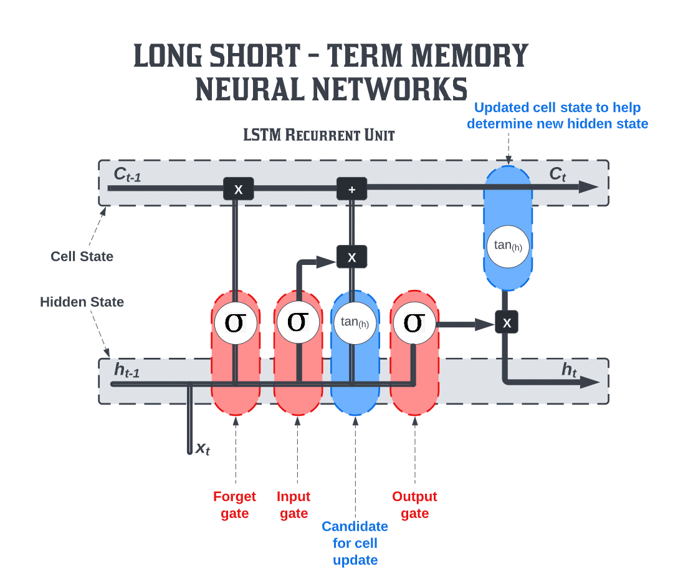
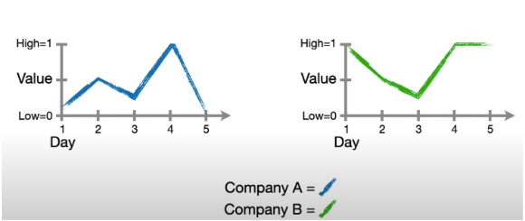

# Installation point

### How to install Pytorch using UV

1. Follow directions here: [Using uv with PyTorch](https://docs.astral.sh/uv/guides/integration/pytorch/)

# Building a LSTM Neural Network Using PyTorch

<p>
  
</p>

[img source](https://www.aiplusinfo.com/blog/introduction-to-long-short-term-memory-ltsm/)

## Project Description

This project utilizes `Long Short-Term Memory (LSTM)` neural networks, a variant of Recurrent Neural Networks (RNN) that address the vanishing graident problem and can better capture long-term dependencies in sequential data.

### What this Project Does Specifically (i.e., the Problem)

For this LSTM example, I imagine that I have two companies: Company A and Company B with five day's worth of stock prices

<p>
  
</p>

[img source](https://youtu.be/YCzL96nL7j0)

Given this sequential data, I want to see if I can get the LSTM to remember what happened on Day 1 through Day 4, to see if I can correctly predict what will happen on Day 5.

`The objective`: I run the data from Day 1 through Day 4 through the LSTM to see If I can predict the values for Day 5 for both Company A and Company B.

For Company A, the goal is to predict that the value on Day 5 = 0, and for Company B,the goal is to predict that the value on Day 5 = 1.

### My Solution

I build two Jupyter notebooks,

- Notebook 1 - Building a Long Short-Term Memory Unit one Component at a time using `PyTorch and Lightning`
- Notebook 2 - Building a Long Short-Term Memory Unit using `PyTorch and Lightning`, but taking advantage of `nn.LSTM()`

Through multiple trainng campaigns, I reveal through analysis of model prediction loss and prediction values using `TensorBoard` when I have sufficiently trained the LSTM models to achieve good prediction capability. Essentially, determining the appropriate weights and biases for the LSTM model.

In particular, from this project you can see:

- Using `nn.LSTM()` simplifies a lot of the set up of building an LSTM model
- Using a higher learning rate (e.g., 0.1) reduces the number of epochs needed to train a model considerably.
- TensorBoard helps to evaluate results visually and keeps records of multiple epoch runs.

---

## Objective

The project contains the key elements:

- `Deep Learning` for neural networks building,
- `Git` (version control),
- `Jupyter` python coded notebooks,
- `Lightning` wrapper for PyTorch to make easier to develop and train deep learning models,
- `Long Short-Term Memory (LSTM)` neural network variant of RNN to process sequential data,
- `Python` the standard modules,
- `PyTorch` Machine Learning framework to train our deep neural network,
- `Recurrent Neural Network (RNN)`,feedback loop neural networks to process sequential data,
- `Tensors` mathematical objects that generalize scalars, vectors, and matrices into higher dimensions. A multi-dimensional array of numbers,
- `TensorBoard` visualization toolkit for TensorFlow that provides tools and visualizations for machine learning experimentation and,
- `uv` package management including use of `ruff` for linting and formatting

---

## Tech Stack


---

## Getting Started

Here are some instructions to help you set up this project locally.

---

## Installation Steps

The Python version used for this project is `Python 3.12` to be compatible with `PyTorch`.

Follow the requirements for [Using uv with PyTorch](https://docs.astral.sh/uv/guides/integration/pytorch/)

- Make sure to use python versions `Python 3.12`
- pip version 19.0 or higher for Linux (requires manylinux2014 support) and Windows. pip version 20.3 or higher for macOS.
- Windows Native Requires Microsoft Visual C++ Redistributable for Visual Studio 2015, 2017 and 2019

### Clone the Repo

1. Clone the repo (or download it as a zip file):

   ```bash
   git clone https://github.com/beenlanced/ltsm_project_pytorch.git
   ```

2. Create a virtual environment named `.venv` using `uv` Python version 3.12:

   ```bash
   uv venv --python=3.12
   ```

3. Activate the virtual environment: `.venv`

   On macOs and Linux:

   ```bash
   source .venv/bin/activate #mac
   ```

   On Windows:

   ```bash
    # In cmd.exe
    venv\Scripts\activate.bat
   ```

4. Install packages using `pyproject.toml` or (see special notes section)

   ```bash
   uv pip install -r pyproject.toml
   ```

### Install the Jupyter Notebook(s)

1. **Run the Project**

   - Run the Jupyter Notebook(s) in the Jupyter UI or in VS Code.

---

## Special Notes

- Getting TensorBoard to work with VS code if you are using VS Code

  - Get the [VS Code Extension](https://devblogs.microsoft.com/python/python-in-visual-studio-code-february-2021-release/)

  - [additional reference](https://stackoverflow.com/questions/63938552/how-to-run-tensorboard-in-vscode)

- To start a TensorBoard session from VS Code:

  - Open the command palette (Ctrl/Cmd + Shift + P)

    - you may need to add tensorboard to your current virtual environment
      - in terminal I used `uv add tensorbard` as I use uv to add modules.
      - Note: all of this should be done for you with this project as all dependencies are in the pyproject.toml file.

  - Search for the command `Python: Launch TensorBoard` and press enter.
  - You will be able to select the folder where your TensorBoard log files are located. By default, the current working directory will be used. Her, I used the `lightning_logs` directory.

    - VS Code will then open a new tab with TensorBoard and its lifecycle will be managed by VS Code as well. This means that to kill the TensorBoard process all you have to do is close the TensorBoard tab.

---

### Final Words

Thanks for visting.

Give the project a star (⭐) if you liked it or if it was helpful to you!

You've `beenlanced`! 😉

---

## Acknowledgements

I would like to extend my gratitude to all the individuals and organizations who helped in the development and success of this project. Your support, whether through contributions, inspiration, or encouragement, have been invaluable. Thank you.

Specifically, I would like to acknowledge:

- [Joshua Starmer - StatQuest](https://youtu.be/YCzL96nL7j0). This project was based off of his Illustrated Guide to Neural Networks and AI course, particularly the LSTM section. Thanks!

- [Hema Kalyan Murapaka](https://www.linkedin.com/in/hemakalyan) and [Benito Martin](https://martindatasol.com/blog) for sharing their README.md templates upon which I have derieved my README.md.

- The folks at Astral for their UV [documentation](https://docs.astral.sh/uv/)

---

## License

This project is licensed under the MIT License - see the [LICENSE](./LICENSE) file for details
